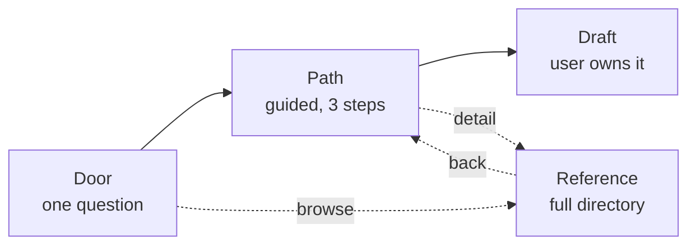

# AI Citizen Action — UX Brief

*As of 22 September 2026*

## What we are building

A tool that converts alarm about AI into one specific, well-aimed action, in a single sitting, ending with a draft the user sends themselves.

The user arrives worried and without standing. They leave having identified the one institution that can act on their particular concern, and holding a finished message addressed to it. Everything else on the site exists to serve that transaction.

The sentence a designer should be able to repeat back: **it tells an ordinary person which door to knock on, and hands them something to say when it opens.**

This is not an awareness site, a campaign, or a database with a search box. It is a guided path that produces an artifact.

## Who this is for

The primary user read or watched something alarming about AI in the last 48 hours and has nowhere to put the feeling.

They are not technical. They have no policy background, no organisational affiliation, and no prior experience contacting government. They may have signed an online petition once. They are arriving on a phone, probably in the evening, probably from a link someone sent them.

Their emotional state is a mix of worry and mild embarrassment. The worry is what brought them. The embarrassment is what will make them leave.

**The false belief that stops them.** They think their concern does not count because they cannot evaluate the technical claims. This is wrong, and correcting it is the site's first job. Several of the channels in the directory were built precisely for non-expert public input; a legislature does not want a literature review from a citizen, it wants to know what constituents think and why.

**What they need in the first ten seconds:** to see that this is for them, that it will not take long, and that nobody is going to sign them up to anything.

| User | Arrives with | Needs | Risk of losing them |
| --- | --- | --- | --- |
| Alarmed newcomer (primary) | Diffuse worry, no target | One door, one draft, a defined end | Bounces at any wall of institutions |
| Person with a specific observation | Something a model did | Routing to a lab channel, evidence format | Sent to a legislator, gets nothing |
| Affected person | A system harmed them or someone they know | A regulator with enforcement power | Sent to a research body, gets nothing |
| Already-engaged advocate | Knows the landscape | Depth, the reference layer, data export | Bored by the guided path |
| Insider | Non-public knowledge | Legal caution before anything else | Acts before getting advice |

Design for the first row. The others should be able to peel off into the reference layer within one click, but they are not who the front door is shaped around.

## The job to be done

Success is one user, in one sitting under twenty minutes, leaving with a message they are about to send to a named recipient who can act on it.

Stated as something observable rather than a feeling: **the user copies or downloads a draft addressed to a specific body.** That is the event the whole design optimises for. Not time on site, not pages viewed, not signups.

Three things have to be true at that moment.

1. The recipient is genuinely able to act on that kind of concern. Sending a good message to a body with no jurisdiction is the failure mode we exist to prevent.
2. The draft is specific enough that a staffer can log a position from it. "Regulate AI" cannot be logged; "I support the third-party evaluation requirement in this bill" can.
3. The user understands why this recipient and not another. If they cannot explain the choice, they will not do it again, and repeat action is where the value compounds.

The secondary job, for the minority who want it, is browsing: letting a more engaged user explore the full landscape without being forced through the guided path.

## Two insights that shape every screen

**One: aim at the seat, not at the user's own representative.**

Every comparable tool asks for a postcode and routes to whoever represents you. That is the wrong instrument here, because an individual's own representative almost certainly has no jurisdiction over AI. Legislatures divide work by committee, and within the committees that hold AI, a small number of seats decide what gets heard — the chair, the ranking or minority member, and in the European Parliament and Brazil the rapporteur who drafts the text.

A message to the chair of the committee that hears AI bills carries more weight than the same message to your own member, even though you cannot vote for them. Many of these bodies accept submissions from anyone; several accept them from outside the country.

The design consequence: **postcode is not the first question.** The first question is what the user wants to happen. Geography narrows the answer later, and sometimes not at all.

The exception, which the site must handle gracefully: when the user wants to be *counted* on a live vote rather than read, their own representative is exactly right, and existing tools do that job well. Hand them off rather than rebuilding it.

**Two: the session ends with a draft, not a link.**

This is the highest-leverage decision in the product. A list of links produces intention; a draft in hand produces action. The moment the site stops being information and becomes a tool is the moment it hands back something the user owns.

The draft must be editable in place, obviously theirs rather than obviously generated, and short. It should carry the user's own words for why they care — a message that reads as a form letter is tallied and discarded, and the site should say so while asking for those words.

## Information architecture: door, path, reference

Three surfaces with different jobs. The hard rule: **a newcomer must never land on the reference.**

**The door.** One question, almost no content: *what do you want to happen?* Five or six answers in plain language. No institution names, no counts, no statistics. Its only job is to make someone feel they are in the right place and to capture intent.

**The path.** Three steps, a progress indicator, one primary action per screen. It narrows intent to a recipient, explains why that recipient, collects the user's own reason, and produces the draft. This is the product.

**The reference.** The full directory — 229 institutions, 144 committees, 50 organisations. Reachable from anywhere, never in the way. For the already-engaged user, for someone verifying a claim, and for the path itself to link into when a user wants detail on a recommended recipient.

Every answer the path produces needs its own URL. "The page for testifying on a California AI bill" should be a link someone can send to a friend, and that link should open mid-path rather than at the door.

## The primary flow

Four screens. The user should be able to see the whole shape before starting: *three steps, about fifteen minutes, you leave with a draft.*

| Screen | What is on it | User does | Leaves with |
| --- | --- | --- | --- |
| 0 · Door | One question, 5–6 plain-language outcomes, a trust line | Picks an outcome | A sense this is for them |
| 1 · Narrow | 2–3 follow-ups: where they are, how specific their concern is | Answers | A named recipient |
| 2 · Why this one | The recipient, its power stated concretely, the mechanism of effect, effort vs leverage | Reads, can swap recipient | Understanding of the choice |
| 3 · Draft | Editable message, prompt for their own reason, the address, what happens next | Edits, copies or downloads | The artifact |
| 4 · Done | Confirmation, one honest next step, nothing more | Leaves | A finished feeling |

**Screen 2 is where trust is won or lost.** It must say what this body can actually do — compel, investigate, fine, advise, only convene — and describe the mechanism: *your submission is published under your name and staff quote from it when writing the report.* That sentence is what makes the action feel real. Include the effort and the honest leverage assessment alongside it.

**Screen 3 must ask for the user's own words.** One prompt, one or two sentences: why this matters to you. Explain in a line that form letters get tallied and discarded while personal ones get read. This is the single highest-value input the user provides and the design should treat it as the centrepiece, not a field at the bottom.

**Screen 4 must end.** Say the action is complete. Offer exactly one next step — usually "tell one person" or "here is when to follow up" — and stop. Open-ended activism is demoralising; a defined ending is what brings people back.

## Principles, made testable

Each of these is a rule a designer can hold a screen against and get a yes or no.

**Welcoming**

- No screen shows more than six choices at once.
- The door contains no institution names, no counts, no statistics.
- The words "you don't need to be an expert" or their equivalent appear above the fold on screen 0.
- No red, no countdowns, no alarming figure in the hero. The subject supplies urgency; the interface supplies steadiness.
- The user's feeling is acknowledged once, in one sentence, and never returned to. Dwelling amplifies it.

**Intuitive**

- Every institutional term appears in plain language first, with the term in parentheses after it.
- At any point, the next action is visible without scrolling.
- The user can complete the path without ever learning what a committee is.
- The length of the journey is stated before it begins.
- One diagram, once, showing how a concern actually travels. Most users have no model of this and without one every instruction sounds arbitrary.

**Empowering**

- Every recommended action states its mechanism of effect, not just the action.
- Every action states effort and honest leverage, including when leverage is low.
- At least one real precedent is shown: an unaffiliated individual whose submission was cited.
- The session ends with an artifact the user owns.
- When the honest answer is that no body has this power in their jurisdiction, the site says so and offers the next-best real option.

That last rule is load-bearing. False hope is the fastest way to destroy the trust agency depends on — the first time a user discovers a channel was oversold, everything else the site said becomes suspect.

## What to refuse

These are not general bad practice. Each one backfires specifically with an anxious user who feels powerless.

| Pattern | Why it backfires here |
| --- | --- |
| Doom counters, urgency bars, ticking clocks | Raises anxiety without raising capability. An anxious user does not act, they close the tab |
| Guilt framing ("if you do nothing…") | Converts worry into shame, and shame into avoidance |
| Badges, streaks, gamification | Trivialises the subject; the reader notices and the site loses authority |
| Signup before value | The user has no reason to trust us yet and every reason to suspect a mailing list |
| An infinite scroll of institutions | Reads as homework; confirms their fear that this is for experts |
| Leading with the lobbying spending gap | Same fact, opposite effect: framed as scale it demoralises, framed as scarcity it motivates |
| A pre-written message with no input from the user | Produces exactly the form letter that gets discarded, while teaching the user that their words don't matter |
| Implying the site has a political ask | Every comparable tool belongs to a campaign. Not having one is our main reason to be trusted |

The lobbying-asymmetry point deserves emphasis because the instinct to lead with it is strong. It belongs deep in the site, framed as *here is where effort is scarce and therefore valuable*, never as *here is how outgunned you are.*

## Content already in hand

The designer is not starting from an empty dataset. Two research passes are complete and exported as JSON.

| Dataset | Contents | Notes for design |
| --- | --- | --- |
| Institutions | 229 bodies, 589 contact routes, remits, and an honest assessment of whether each channel works | Each carries an access level: open, limited, or none |
| Committees and seats | 144 bodies with AI jurisdiction across 27 jurisdictions, 126 with named current holders | Each has a "what does NOT belong here" field — this is what makes routing possible |
| Organisations | 50 campaigns, civil society, professional and industry bodies, each with its ask stated plainly | Needed for the "join something" outcome |
| Source index | 1,170 sources with three-state verification | 774 verified, 145 unverified, 251 unchecked |

**The field that makes the product work** is the negative jurisdiction statement. For example: Senate Commerce owns frontier AI regulation, the FTC, NIST and CAISI — but not copyright or liability, which sit with Judiciary; not federal agency AI use, which is Homeland Security; not military AI or chip export controls. That distinction is the knowledge a staffer has and a citizen does not, and surfacing it is most of the site's value.

**Known decay, which the design must accommodate.** Named seat-holders change with elections, reshuffles and annual committee reconstitutions; EU rapporteurs change with every file. Every name carries a checked-on date and a link to the institution's own live membership list. The interface should show the date beside the name and treat the membership link as a first-class element, not a footnote — when a name is stale the structure still works, because the user can click through.

**The honest floor.** For a meaningful number of jurisdictions the true answer is that no body currently has power over frontier AI. The design needs a good-looking, non-apologetic state for this that offers the next-best action rather than an error.

## Edge cases and states

These are not afterthoughts. Several of them are where the site either earns trust or loses it.

| State | What must happen |
| --- | --- |
| No body has this power in their jurisdiction | Say so plainly, without apology. Offer the next-best real route — usually a bloc-level body, an international consultation, or an organisation to join |
| Named holder is stale | The date is visible beside every name; the live membership link is prominent, not buried. Never present a name as current without its date |
| User is outside covered jurisdictions | The generic method: how to find the technology committee in any parliament, and the four routes that exist in nearly every democracy |
| User's concern is a model behaviour they observed | Route to the lab's own safety channel and the evidence format, not to a legislator |
| User is distressed rather than concerned | One calm sentence, no crisis language, no assessment questions. Offer the action, and make it easy to leave |
| User is an insider with non-public knowledge | Stop the flow. Legal advice before any contact, including with the organisations we list. This is the one case where the site should decline to route |
| User wants to be counted on a live vote | Hand off to the existing constituent-contact tools. Do not rebuild them |
| Route is unverified | Mark it. A lead to confirm is not an address to rely on, and conflating them costs us credibility once |
| Non-English-language route | State the language before the user clicks. Several portals are formally open but practically closed to non-speakers |

The insider case is worth designing carefully. It is rare, it is high-stakes, and getting it wrong could harm someone. The right behaviour is a full stop with a short explanation, not a cleverly routed onward journey.

## How we will know it works

The primary measure is **completion: the proportion of arrivals who leave with a draft.** Everything else is diagnostic.

| Measure | What it tells us |
| --- | --- |
| Draft completion rate | The core measure. Arrivals who reach screen 3 and copy or download |
| Drop-off by screen | Where the path loses people. Screen 1 drop-off means the questions are wrong; screen 2 means we failed to make the recipient feel worth writing to |
| Proportion who add their own words | Whether the personalisation prompt is working. A low rate means we have built a form-letter machine |
| Return rate | Whether a completed action makes people come back. The compounding measure |
| Time to first action | Should be under fifteen minutes. Rising time means the path has accreted content |

**The counter-metric.** Time on site and pages viewed must not be treated as success. A user who spends forty minutes reading institution records and leaves without a draft has had a worse experience than one who leaves in eight minutes holding something. If those numbers start being celebrated, the product will drift back into being a database.

**What to test with users, before building.** Five people who match the primary portrait, given the prototype cold, on a phone. Watch for three things: whether they understand within ten seconds that this is for them; whether they can explain, unprompted, why the recommended recipient was chosen; and whether they actually write something in their own words or skip that field. The third is the one most likely to fail, and it is the one that matters most.

## Deliverables, constraints and open questions

**What we are asking for**

1. Wireframes for the four path screens plus the door, at phone width first. Desktop is the secondary case.
2. The empty and honest-floor states, designed as first-class screens rather than error handling.
3. A component approach for the recipient card — it must carry name, power, mechanism of effect, effort, leverage, checked-on date and live membership link without becoming a wall.
4. The draft-editing surface. This is the most important screen and deserves the most attention.
5. One diagram explaining how a concern travels, suitable for a first-time reader.

**Constraints**

- Phone-first. The primary user arrives on a phone from a shared link, in the evening.
- No signup, no tracking that requires a consent wall, no mailing list gate.
- Must work as static pages. The dataset is JSON and can be shipped with the site.
- Accessible by default: real contrast, keyboard navigation, no meaning carried by colour alone.
- Light and dark both designed, not inverted.

**Open questions we have not resolved**

- [ ] Does the door ask for location at all, or do we infer jurisdiction later from the outcome chosen?
- [ ] Do we let a user complete a draft for a body in a country they do not live in? Several accept foreign submissions, but it may reduce the message's weight
- [ ] How prominent is the "join an organisation" outcome? It is the most effective option for most people and also the one that hands them someone else's ask
- [ ] Do we show the industry-lobbying layer to a first-time user at all, or only in the reference?
- [ ] Who maintains the named seat-holders, and how often? The product's credibility decays without an answer
